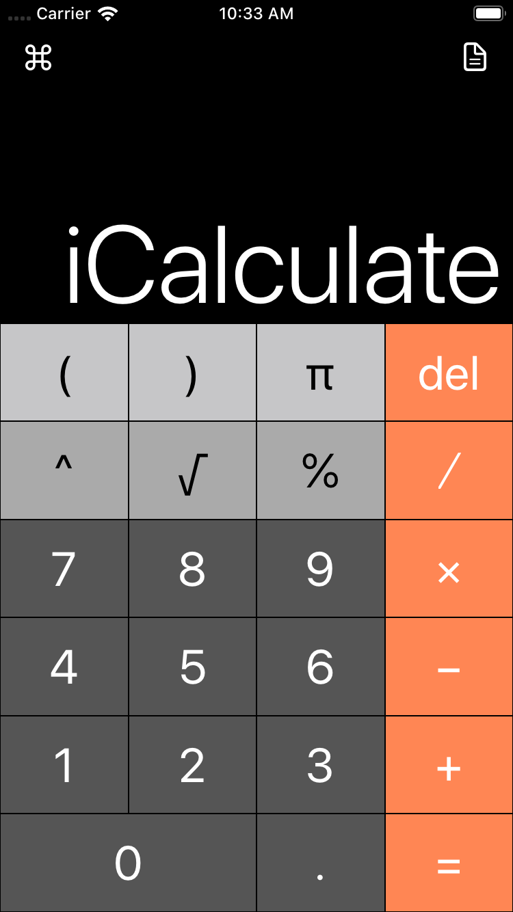
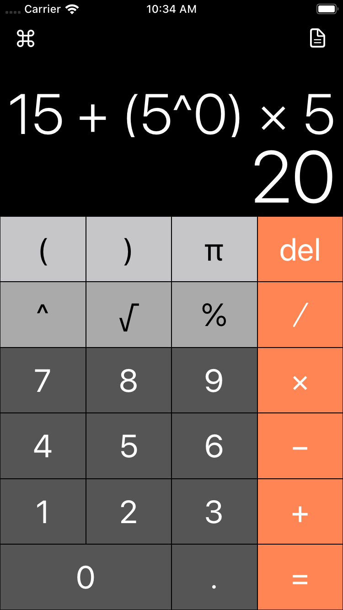
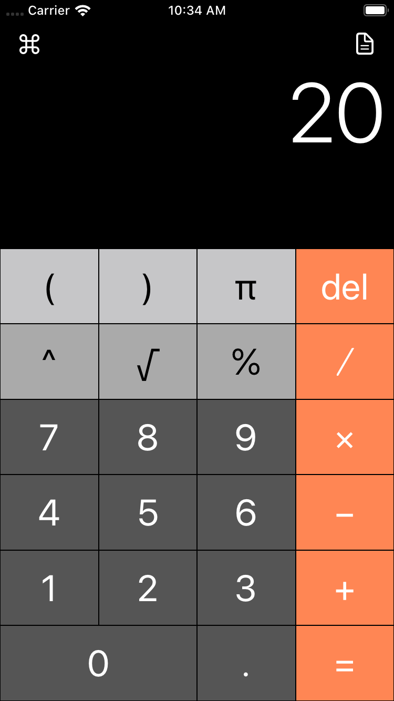
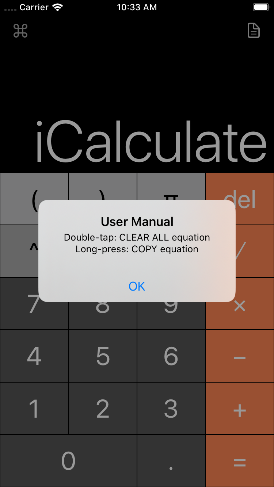
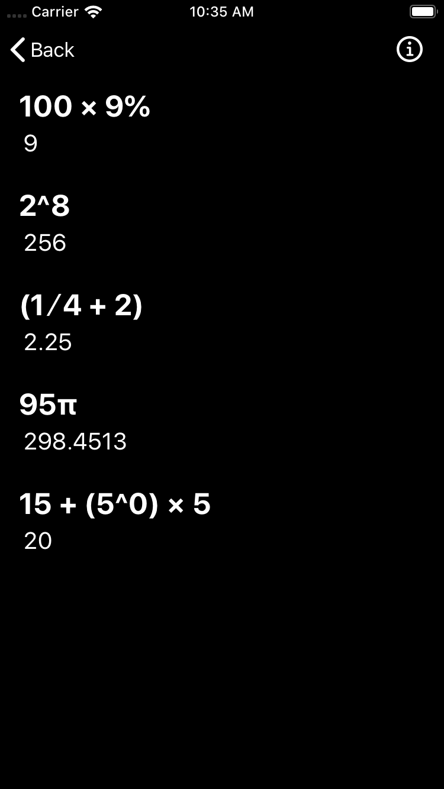
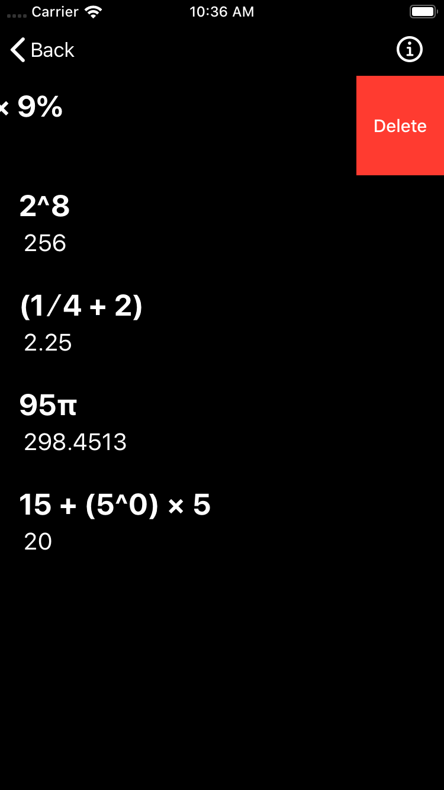
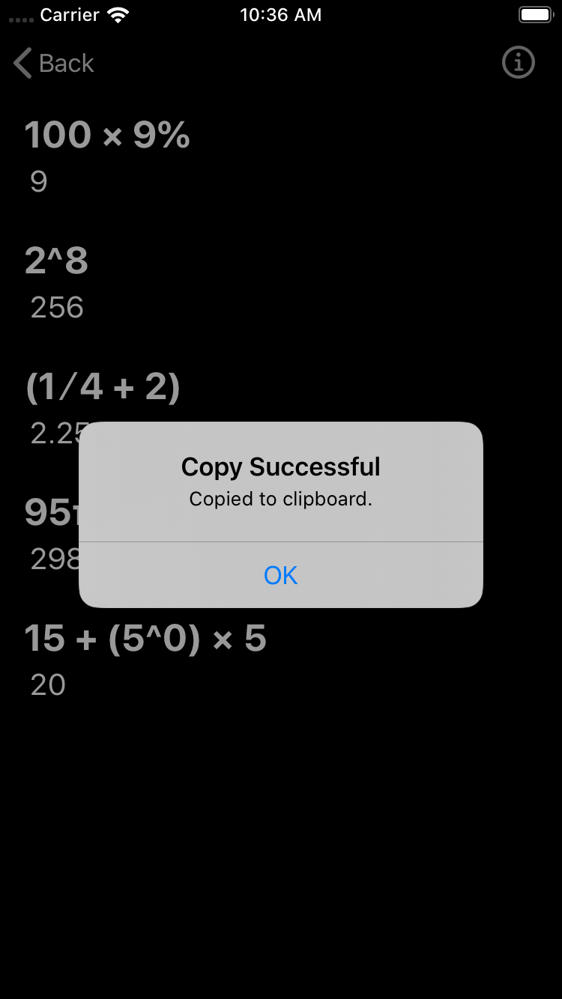

#  iCalculate

This is a calculator app developed for an individual assignment in EE4304 iOS Development and Networking course at City University of Hong Kong.  

**Check out more screenshots at the bottom**

## Requirements

- [x] Math equation field
- [x] Equation result field (on-the-fly)
- [x] Digit `0 to 9`
- [x] Decimal point `.`
- [x] Operators ​`+` `-` `x` `/` `(` `)` `%` `​√`
- [x] Delete

## Additional Features

- [x] Long-press on equation area to copy the equation and result to clipboard
- [x] Double-tap on equation area to clear all
- [x] History (added when `=` is pressed)
- [x] More operators `^`(power) `π`(pi) 
- [x] Layout for all devices

## Author

Copyright (c) 2019 Kevin Kim

# Screenshots

